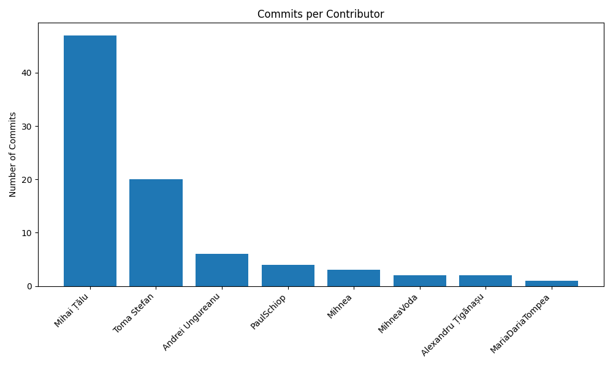
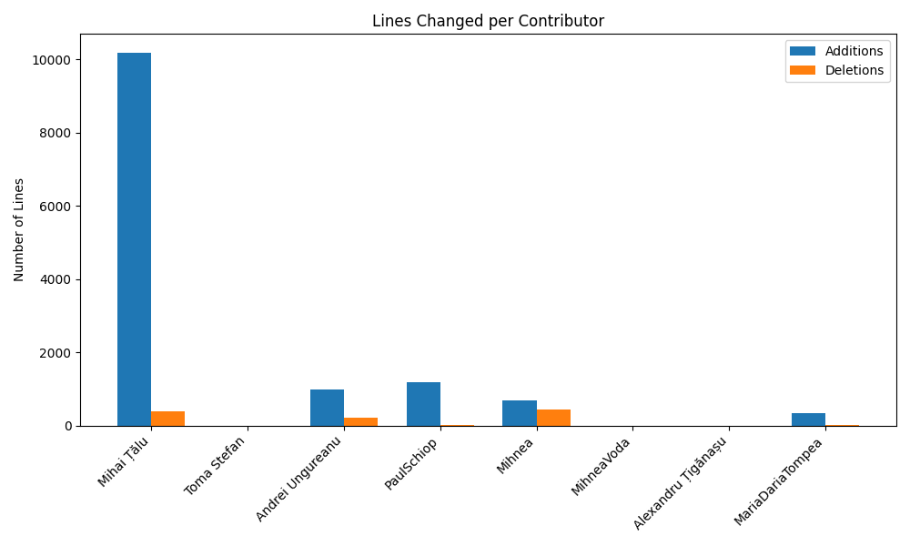
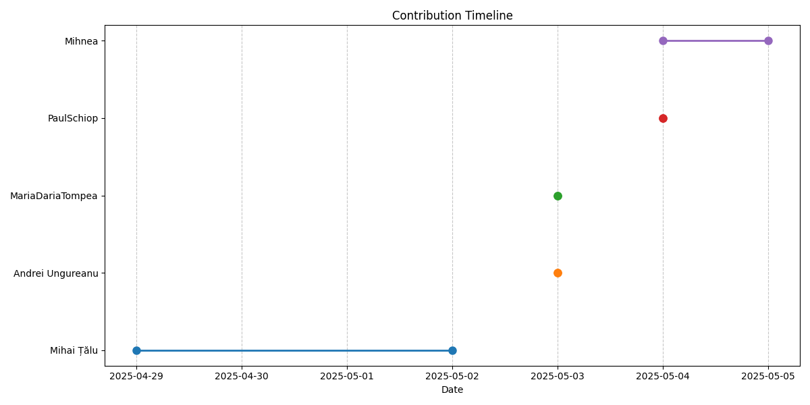
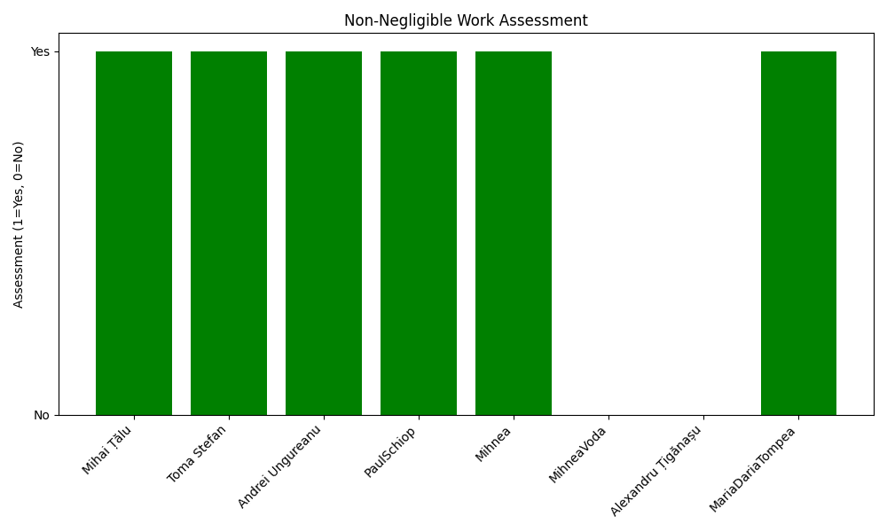

# Team Babes - Something Something Social
Welcome to the GitHub repository for **Team Babes**! This section of the Workout App is designed to help users share their fitness journeys, connect with friends, and stay motivated through posts, workouts, meals, and group interactions.

---

## Project Overview  
Our section is a social platform where users can:  
- Share **posts** about their fitness journey.  
- Log **workouts** and **meals**.  
- Join **groups** to connect with like-minded individuals.  
- Follow other users and interact with their content.  

This section is built with a focus on usability, responsiveness, and a seamless user experience.

---

## Features  
- **Home Page**:  
  - Feed of posts with infinite scrolling.  
  - App Bar with navigation buttons and visual highlighting for the active tab.  
- **Create Post**:  
  - Modal for creating posts with optional text, images, tags, and visibility settings.  
- **Groups**:  
  - Join groups, view group-specific posts, and create new groups.  
- **User Profile**:  
  - View posts, workouts, meals, and followers.  
  - Follow/unfollow other users.  
- **Login/Register**:  
  - Secure authentication with email and password.  
  - Optional profile image upload during registration.  

## Coding Style and Conventions

This document outlines the coding style and conventions to be followed in this project to ensure consistency, readability, and maintainability.

### 1. Class, Struct, and Enum Naming

- Use PascalCase for all class, struct, and enum names.
  - ✅ Example: `CommentService`, `OrderViewModel`

### 2. Interface Naming

- Prefix all interfaces with the letter "I" and use PascalCase.
  - ✅ Example: `ICommentRepository`, `IUserService`

### 3. Method Naming

- Use PascalCase for method names.
- Method names should be descriptive and action-oriented.
  - ✅ Example: `GetUserDetails()`, `CalculateTotalCalories()`

### 4. Property and Field Naming

- Use PascalCase for properties and fields.
  - ✅ Example:
    ```csharp
    // Property
    public string FirstName { get; set; }

    // Field
    private readonly ICommentRepository commentRepository;
    ```

### 5. Variable Naming

- Use camelCase for local variables and method parameters.
  - ✅ Example:
    ```csharp
    var totalPrice = 0;
    ```

### 6. Asynchronous Methods

- Name asynchronous methods with an "Async" suffix.
  - ✅ Example: `SaveChangesAsync()`, `LoadDataAsync()`

### 7. Interface Usage and Implementation

- All classes must have a corresponding interface, except for pure Entity classes (e.g., `User`, `Product`, `Order`).
- Teams should always depend on interfaces, not on concrete classes, to improve testability, maintainability, and flexibility.
- The interface name must match the class name, prefixed with `I`.
  - ✅ Example: `UserService` → `IUserService`

### 8. Namespace Organization

- Follow a logical structure that mirrors the folder structure.
- Namespaces should reflect the pattern:
ProjectName.MVVM.Views
ProjectName.MVC.Controllers
ProjectName.Services

### 9. File Naming

- Each class, interface, or enum must be in its own file, and the file name must match the class/interface/enum name exactly.
- ✅ Example: `OrderService.cs`, `IOrderService.cs`

### 10. Braces and Indentation

- Always use braces `{}`, even for single-line blocks.
- Use 4 spaces for indentation (no tabs).

### 11. Class Naming Should Reflect Responsibility

- Class names must clearly represent the entity or concept they are responsible for, using appropriate suffixes:
- Controllers must have a `Controller` suffix.
- ViewModels must have a `ViewModel` suffix.
- Services must have a `Service` suffix.
- Repositories must have a `Repository` suffix.
- Proxies must have a `Proxy` suffix.
- DTOs (Data Transfer Objects) must have a `Dto` suffix.
- ✅ Examples:
  ```
  UserController
  UserViewModel
  UserService
  UserRepository
  UserProxy
  UserDto
  ```

### 12. Dependency Injection

- Always inject dependencies via the constructor.
- Avoid service locator or manual instantiations inside classes.

### 13. Comments and Documentation

- Use XML documentation comments (`///`) for public methods, properties, and classes.
- Keep comments meaningful and avoid redundant comments that state the obvious.

### 14. Consistent Use of `this` Keyword

- Use the `this` keyword when referencing instance members within a class to improve code clarity.
- ✅ Example:
  ```csharp
  this.userName = userName;
  ```

### 15. Constant Naming (Capital Letters)

- Constants must be named using PascalCase or `ALL_CAPS_WITH_UNDERSCORES` (team must choose one and be consistent).
- For important constants (especially global or shared ones), prefer `ALL_CAPS_WITH_UNDERSCORES` style.
- Constants should be declared as `const` or `static readonly` depending on the situation.
- ✅ Good Example:
  ```csharp
  private const string DEFAULT_USER_ROLE = "User";
  ```

### 16. Magic Numbers

- Avoid magic numbers directly in the code.
- All hard-coded numeric values and important string literals must be moved into a named constant, an enum, or a configuration file.
- Code should be self-explanatory by reading constant names.
- ✅ Good Example:
  ```csharp
  private const int MAX_RETRY_COUNT = 3;
  ```

### 17. Test Class Naming

- Use the same name as the class being tested, suffixed with Tests.

- ✅ Example:
```csharp
UserService → UserServiceTests
```

### 18. Test Method Naming

- Use the pattern:
- MethodName_Scenario_ExpectedOutcome

- ✅ Examples:
```csharp
GetUserById_UserExists_ReturnsUser()

CreateOrder_InvalidInput_ThrowsException()
```
- This improves readability and test discoverability.

### 19. AAA Pattern (Arrange-Act-Assert)

- Structure test methods using the AAA pattern for clarity.

- ✅ Example:
```csharp
// Arrange
var userService = new UserService(mockRepo.Object);

// Act
var result = userService.GetUserById(1);

// Assert
Assert.NotNull(result);
```

## Conditii folosire Git

- Trebuie respectate deadline-ul (sambata seara)
- Inainte sa dea push sa incerce mereu un "git pull --rebase origin main"
- Fiecare trebuie sa rezolve confictele daca este cazul
- Nu ai voie sa dai push pe git daca ai erori mereu testezi sa vezi ca aplicatia ruleaza sau macar da build
- ucrati doar pe branch-ul vostru
- folosit git add . pentru a specifica fisierele pe care vreti sa le adaugati cand creati un commit ("." reprezinta current directory)
- pentru fiecare task/ lucru nou creati un commit nou (git commit -m "scurta descriere")
- commit-ul trebuie sa contina o descriere foarte pe scurt a ce ati facut
- Inainte sa dea push sa incerce mereu un "git pull --rebase origin main"
- "git push" pentru a se trimite pe github
- dupa fiecare commit creati un pull request
- nu dati merge la codul voastru pana nu a fost verificat de cineva
- nu dati force push la cod. Dati mesaj pe grup poate se rezolva intre timp

# Git Contribution Report
Generated on: 2025-05-20 11:12:30
Repository: UBB-SE-2025-927-2
Date Range: From: 2025-04-01, To: 2025-05-20

## Visualizations
### Commits per Contributor

### Lines Changed

### Contribution Timeline

### Non-Negligible Work Assessment


## Detailed Analysis
### Mihai Țălu
### talumihai@gmail.com
#### Commit Statistics
- Total Commits: 88
- First Commit: 2025-04-29
- Last Commit: 2025-05-20
- Active Days: 6
- Contribution Timespan: 22 days
- Average Commits Per Active Day: 4.00

#### Code Changes
- Lines Added: 10181
- Lines Deleted: 380
- Total Lines Changed: 10561

#### Branches Used
- main

#### Files Changed
- Total Files: 127
- File Types:
  - .cs: 105
  - .xaml: 16
  - .sql: 6

#### Contribution Assessment
- **Non-Negligible Work**: Yes
- Reasoning:
  - Made 88 commits (threshold: 5)
  - Changed 10561 lines of code (threshold: 100)
  - Active on 6 days (threshold: 3)

---
### Stefan2114
### stefan.toma021@gmail.com
#### Commit Statistics
- Total Commits: 71
- First Commit: 2025-04-23
- Last Commit: 2025-05-19
- Active Days: 9
- Contribution Timespan: 27 days
- Average Commits Per Active Day: 2.63

#### Code Changes
- Lines Added: 91892
- Lines Deleted: 4542
- Total Lines Changed: 96434

#### Branches Used
- main

#### Files Changed
- Total Files: 229
- File Types:
  - .cs: 319
  - .json: 32
  - .cshtml: 20
  - .xaml: 19
  - .csproj: 13

#### Diagrams Created/Modified: 9

#### Code Review Participation: 2 reviews

#### Contribution Assessment
- **Non-Negligible Work**: Yes
- Reasoning:
  - Made 71 commits (threshold: 5)
  - Changed 96434 lines of code (threshold: 100)
  - Active on 9 days (threshold: 3)

---
### Andrei Ungureanu
### andreiungureanu2014@yahoo.ro
#### Commit Statistics
- Total Commits: 32
- First Commit: 2025-05-03
- Last Commit: 2025-05-19
- Active Days: 8
- Contribution Timespan: 17 days
- Average Commits Per Active Day: 1.88

#### Code Changes
- Lines Added: 1706
- Lines Deleted: 832
- Total Lines Changed: 2538

#### Branches Used
- main

#### Files Changed
- Total Files: 69
- File Types:
  - .cs: 70
  - .json: 13
  - .cshtml: 8
  - .sql: 4
  - .csproj: 3

#### Contribution Assessment
- **Non-Negligible Work**: Yes
- Reasoning:
  - Made 32 commits (threshold: 5)
  - Changed 2538 lines of code (threshold: 100)
  - Active on 8 days (threshold: 3)

---
### PaulSchiop
### schioppaul@gmail.com
#### Commit Statistics
- Total Commits: 10
- First Commit: 2025-05-04
- Last Commit: 2025-05-19
- Active Days: 4
- Contribution Timespan: 16 days
- Average Commits Per Active Day: 0.62

#### Code Changes
- Lines Added: 2104
- Lines Deleted: 150
- Total Lines Changed: 2254

#### Branches Used
- main

#### Files Changed
- Total Files: 37
- File Types:
  - .cs: 44
  - .json: 6
  - .cshtml: 5
  - .csproj: 2
  - .sql: 1

#### Contribution Assessment
- **Non-Negligible Work**: Yes
- Reasoning:
  - Made 10 commits (threshold: 5)
  - Changed 2254 lines of code (threshold: 100)
  - Active on 4 days (threshold: 3)

---
### Mihnea
### mihnea.voda@stud.ubbcluj.ro
#### Commit Statistics
- Total Commits: 7
- First Commit: 2025-05-04
- Last Commit: 2025-05-17
- Active Days: 3
- Contribution Timespan: 14 days
- Average Commits Per Active Day: 0.50

#### Code Changes
- Lines Added: 1511
- Lines Deleted: 901
- Total Lines Changed: 2412

#### Branches Used
- main

#### Files Changed
- Total Files: 40
- File Types:
  - .cs: 56
  - .json: 6
  - .cshtml: 4
  - .csproj: 3

#### Contribution Assessment
- **Non-Negligible Work**: Yes
- Reasoning:
  - Made 7 commits (threshold: 5)
  - Changed 2412 lines of code (threshold: 100)
  - Active on 3 days (threshold: 3)

---
### Alexandru Țigănașu
### alexandru.tiganasu@stud.ubbcluj.ro
#### Commit Statistics
- Total Commits: 6
- First Commit: 2025-05-02
- Last Commit: 2025-05-18
- Active Days: 3
- Contribution Timespan: 17 days
- Average Commits Per Active Day: 0.35

#### Code Changes
- Lines Added: 999
- Lines Deleted: 264
- Total Lines Changed: 1263

#### Branches Used
- main

#### Files Changed
- Total Files: 36
- File Types:
  - .cs: 37
  - .json: 4
  - .cshtml: 2

#### Contribution Assessment
- **Non-Negligible Work**: Yes
- Reasoning:
  - Made 6 commits (threshold: 5)
  - Changed 1263 lines of code (threshold: 100)
  - Active on 3 days (threshold: 3)

---
### BogdanSchiop5
### schiopbogdan2004@gmail.com
#### Commit Statistics
- Total Commits: 5
- First Commit: 2025-05-05
- Last Commit: 2025-05-05
- Active Days: 1
- Contribution Timespan: 1 days
- Average Commits Per Active Day: 5.00

#### Code Changes
- Lines Added: 630
- Lines Deleted: 55
- Total Lines Changed: 685

#### Branches Used
- main

#### Files Changed
- Total Files: 25
- File Types:
  - .cs: 30
  - .json: 2

#### Contribution Assessment
- **Non-Negligible Work**: Yes
- Reasoning:
  - Made 5 commits (threshold: 5)
  - Changed 685 lines of code (threshold: 100)

---
### PatrickSzm
### patrickszmuck@yahoo.com
#### Commit Statistics
- Total Commits: 5
- First Commit: 2025-05-03
- Last Commit: 2025-05-19
- Active Days: 3
- Contribution Timespan: 17 days
- Average Commits Per Active Day: 0.29

#### Code Changes
- Lines Added: 1113
- Lines Deleted: 190
- Total Lines Changed: 1303

#### Branches Used
- main

#### Files Changed
- Total Files: 32
- File Types:
  - .cs: 47
  - .json: 5
  - .sql: 2
  - .cshtml: 1
  - .csproj: 1

#### Contribution Assessment
- **Non-Negligible Work**: Yes
- Reasoning:
  - Made 5 commits (threshold: 5)
  - Changed 1303 lines of code (threshold: 100)
  - Active on 3 days (threshold: 3)

---
### MariaDariaTompea
### mariatompea@gmail.com
#### Commit Statistics
- Total Commits: 2
- First Commit: 2025-05-03
- Last Commit: 2025-05-17
- Active Days: 2
- Contribution Timespan: 15 days
- Average Commits Per Active Day: 0.13

#### Code Changes
- Lines Added: 692
- Lines Deleted: 19
- Total Lines Changed: 711

#### Branches Used
- main

#### Files Changed
- Total Files: 16
- File Types:
  - .cs: 13
  - .json: 2
  - .csproj: 1
  - .cshtml: 1

#### Code Review Participation: 2 reviews

#### Contribution Assessment
- **Non-Negligible Work**: Yes
- Reasoning:
  - Changed 711 lines of code (threshold: 100)

---
### MihneaVoda
### 147316786+desixtt@users.noreply.github.com
#### Commit Statistics
- Total Commits: 2
- Active Days: 1
- Average Commits Per Active Day: 2.00

#### Code Changes
- Lines Added: 0
- Lines Deleted: 0
- Total Lines Changed: 0

#### Files Changed
- Total Files: 0

#### Contribution Assessment
- **Non-Negligible Work**: No
- Reasoning:
  - Did not meet minimum thresholds for non-negligible work

---
### donFelippe
### filip.rus@yahoo.com
#### Commit Statistics
- Total Commits: 1
- First Commit: 2025-05-05
- Last Commit: 2025-05-05
- Active Days: 1
- Contribution Timespan: 1 days
- Average Commits Per Active Day: 1.00

#### Code Changes
- Lines Added: 108
- Lines Deleted: 0
- Total Lines Changed: 108

#### Branches Used
- main

#### Files Changed
- Total Files: 4
- File Types:
  - .cs: 4

#### Contribution Assessment
- **Non-Negligible Work**: Yes
- Reasoning:
  - Changed 108 lines of code (threshold: 100)

---
